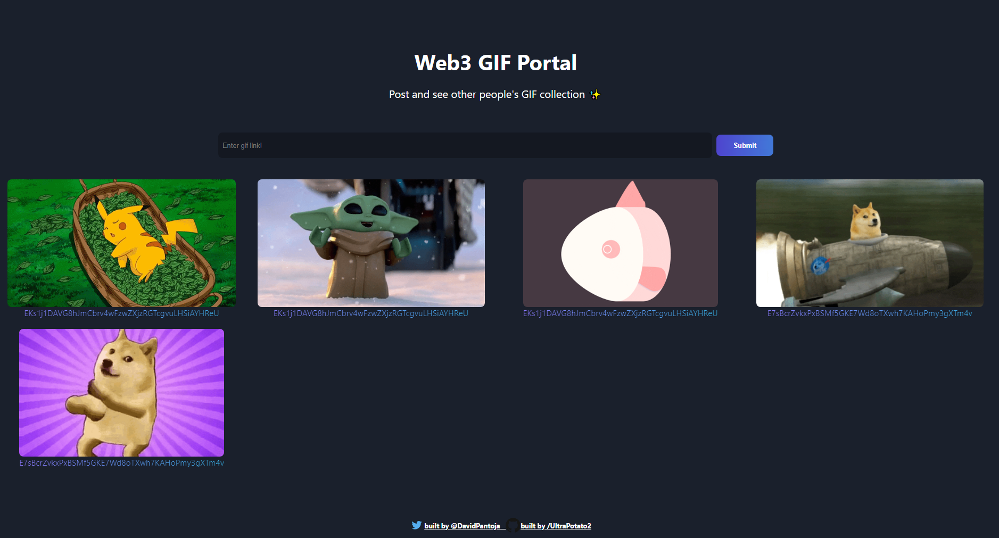
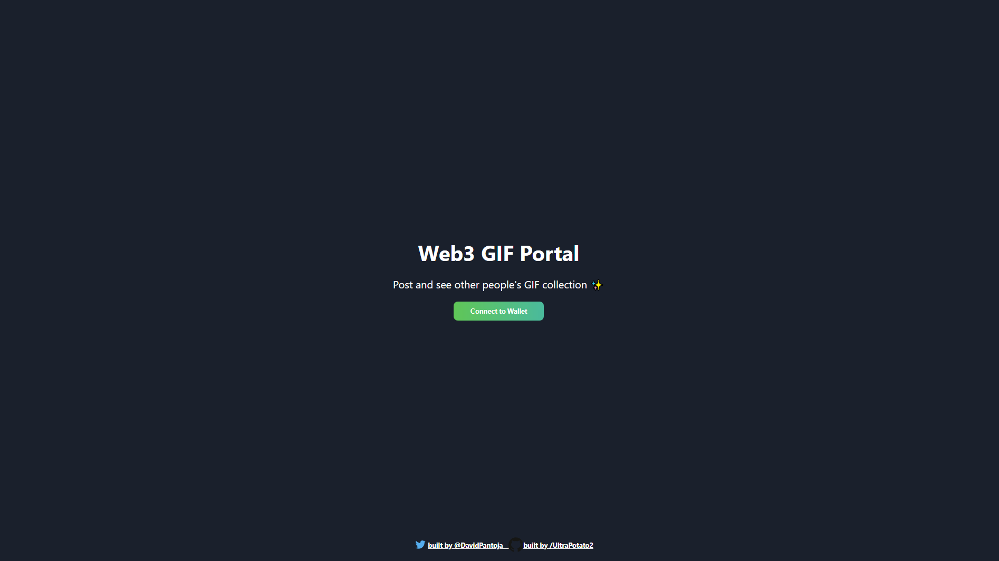

  <a href="#calling-about">About</a>&nbsp;&nbsp;&nbsp;|&nbsp;&nbsp;&nbsp;
  <a href="#1234-run">Run</a>&nbsp;&nbsp;&nbsp;|&nbsp;&nbsp;&nbsp;
  <a href="#gear-core-tech-stack">Tech Stack</a>&nbsp;&nbsp;&nbsp;|&nbsp;&nbsp;&nbsp;
  <a href="#sparkles-main-features">Features</a>&nbsp;&nbsp;&nbsp;|&nbsp;&nbsp;&nbsp;
  <a href="#camera_flash-screenshots">Screenshots</a>&nbsp;&nbsp;&nbsp;|&nbsp;&nbsp;&nbsp;
  <a href="#memo-license-">License</a>&nbsp;&nbsp;&nbsp;|&nbsp;&nbsp;&nbsp;
  <a href="#warning-disclaimer">Disclaimer</a>

<h1 align="center">
   <em>Web3 GIF Portal</em>
</h1>

 

## :calling: About

This app was built on Solana to allow anyone to submit a gif link which is saved on Solana's blockchain. This was built on the devnetwork so reworking may take a few changes. This project is also split into two: the smart contract and web application.

## :1234: Run

- Setting up solana for smart contracts might be complicated. Check out [Windows](https://github.com/buildspace/buildspace-projects/blob/main/Solana_And_Web3/en/Section_2/Resources/windows_setup.md 'Windows') or [M1_mac](https://github.com/buildspace/buildspace-projects/blob/main/Solana_And_Web3/en/Section_2/Resources/m1_setup.md 'M1_mac')
- To run the webApp 'cd webApp' then just go 'npm install' then 'npm start'
- to run the smart contracts go 'cd smartContract' then 'npm install' then 'solana-keygen new' then verify it worked ny checking address with 'solana address' then run 'anchor test'. to deploy run 'anchor deploy' after airdropping SOL to your wallet with 'solana airdrop 2' done 3 times. If you want to edit the smart contract you have to mess around with idl.js . For more information visit :horse: &nbsp; [BuildSpace](https://app.buildspace.so/ 'BuildSpace').

## :gear: Core Tech Stack

- :electron:&nbsp; [React](https://reactjs.org/ 'React')
- :anchor:&nbsp; [React Native Paper](https://callstack.github.io/react-native-paper/index.html 'React Native Paper')
- :money_with_wings: &nbsp; [Solana](https://solana.com/developers 'Solana')

## :sparkles: Main Features

- login through Phantom
- Blockchaion storage of data
- Multiple users possible

## :camera_flash: Screenshots

    
    

## :memo: License 

- This project is under the terms of the MIT license. For more information, please refer to the license [documentation](LICENSE).

## :warning: Disclaimer

- The contents of these pages are provided as an information guide only. While every effort is made in preparing the material for publication, no responsibility is accepted by or on behalf of the owner(s) for any errors, omissions or misleading statements on these pages or any site to which these pages connect. Although every effort is made to ensure the reliability of listed sites this cannot be taken as an endorsement of these sites.

## Special Thanks to BuildSpace

- Alot of the structure and user interface was inspired by their documents. Please check them out if you are learning! :horse: &nbsp; [BuildSpace](https://app.buildspace.so/ 'BuildSpace')
